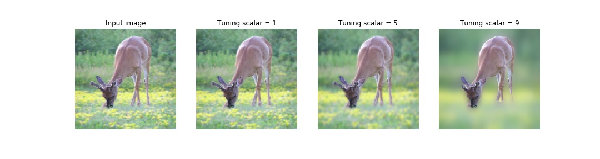
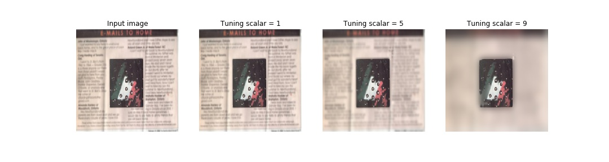
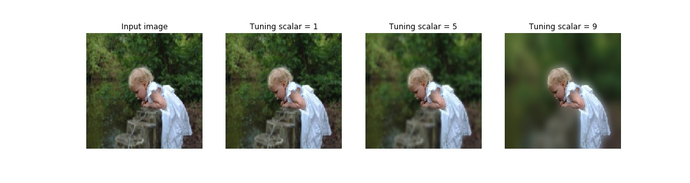
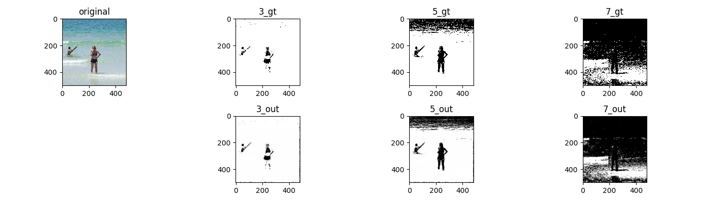
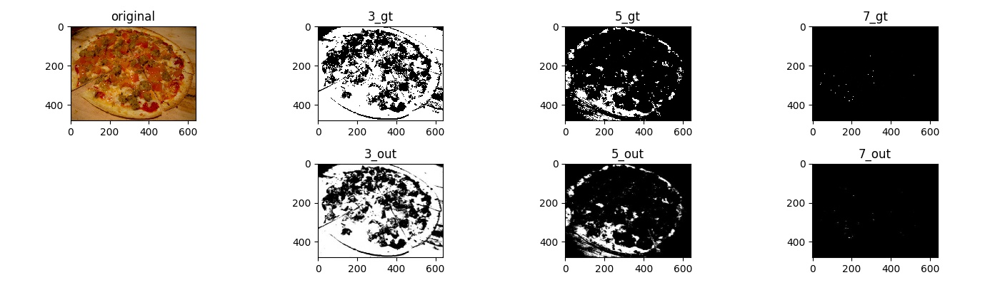
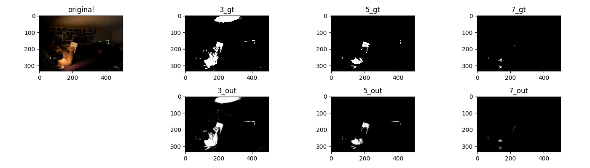

# [Implementation of "Tunable U-Net: Controlling image-to-image outputs using a tunable scalar value"](https://ieeexplore.ieee.org/document/9481244)

## Requirements

* Python == 3.6.6

* Pytorch == 1.8.1

* Numpy == 1.15.3

* OpenCV >= 3.x (cv2)

* PIL = 5.3.0

* Matplotlib == 3.0.0

* tqdm == 4.28.1

* visdom == 0.1.8.9

Download pre-trained weights for blurring experiment from [here](https://drive.google.com/file/d/1VtxIE3Uu_5GsPttSlrTorxHdFictiPGk/view?usp=sharing), and dataset from [here](https://drive.google.com/file/d/1jM-tNRF25bxAXvP10wQ40u9P41Q_tQ5e/view?usp=sharing)

## Blurring Results:

## Binarization Results:

